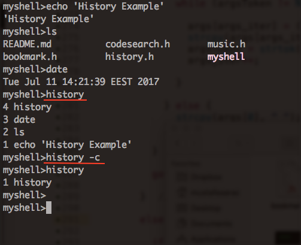
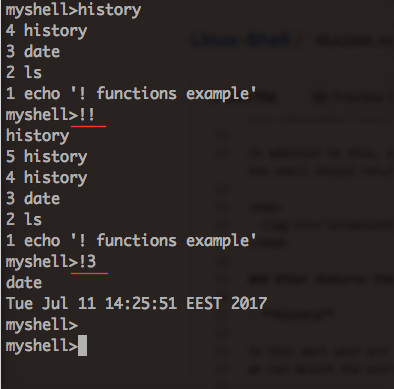
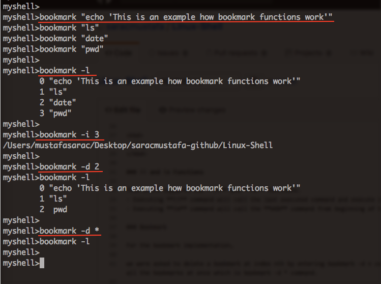
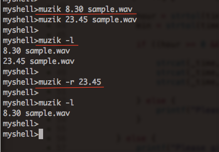
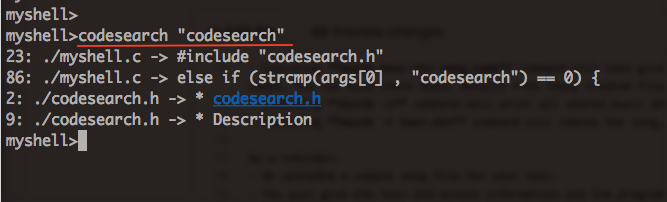
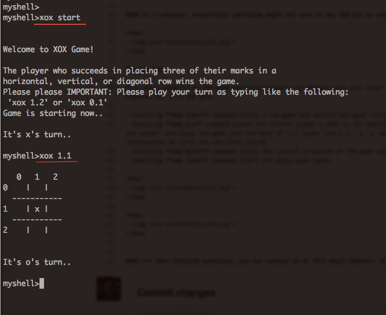
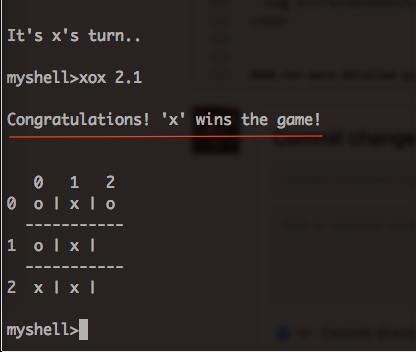
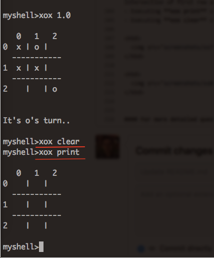

# Linux-Shell

:computer: &nbsp;**Spring 2017 COMP 304 Operating Systems Course Project, Koç University**

The final version of this code has been developed by **Mustafa SARAÇ** and **Musa ÇIBIK** as a project of Operating Systems (COMP 304) course. **Koç University's code of ethics can be applied to this code and liability can not be accepted for any negative situation. Therefore, be careful when you get content from here.**

#### :heavy_exclamation_mark: IMPORTANT FOR MAC OSX USERS :heavy_exclamation_mark:
**muzik** command, which is one of the features that our shell program has, may not work in **Mac OS X** and might give error such that **"/bin/sh: play: command not found"**. 

In case of having this error, you need to do the followings:
- If you do not have installed **sox** music player program before, please first install it. Link: [How to install sox on Mac OSX](http://macappstore.org/sox/)
- Then, you need to change the **line 87 of music.h** file like the following code:	

```
// fprintf(f, "play "); This line will be changed like the following
fprintf(f, "/usr/local/bin/play ");
```

#### If you continue to have trouble, you can contact me at this email address: msarac13@ku.edu.tr &nbsp;&nbsp;:email:

### Description 

In this project, we implemented an interactive Linux-based operating system shell. We have added several customized commands, such as bookmark, codesearch, muzik and xox, as well as basic commands that a standard Linux-based shell can have. Therefore, this shell program supports basic commands like **cd 'some_directory', cd .., ls, mv, pwd, mkdir, rm, echo, hostname, date** and more. 

This program reads the next command line, parses and separates it into distinct arguments using blanks as delimiters. In order to execute these basic commands, we used **execv()** C programming language command instead of **execvp()**. We checked all the possible paths that have executable files in them. When we achieve the given command in any path, we executed it. 

In addition to this, shell supports background execution of programs. An **ampersand (&)** at the end of the command line indicates that the shell should return the command line prompt immediately after launching that program like in the following screenshot. 

<kbd>
  
</kbd>

### Other features that shell program has:

### History

This shell supports 2 **history** commands. 
- Executing **history** command prints all commands that are executed previously after the last history clear operation.
- Executing **history -c** command clears the commands that are stored in history.

<kbd>
  
</kbd>

### !! and !n Functions

This shell supports the **!!** and **!n** commands.
- Executing **!!** command calls the last executed command and executes it. 
- Executing **!n** command calls the command at index **nth** from beginning of the history and executes it.


<kbd>
  
</kbd>

### Bookmark

This shell supports some **bookmark** commands. This feature will enable users to reach frequently used commands.
- Executing **bookmark "command-name"** command adds the given command to the bookmark. 
- Executing **bookmark -l** command prints all commands that are executed previously after the last bookmark clear operation. 
- Executing **bookmark -i n** command executes the bookmark at index **nth** from the beginning.
- Executing **bookmark -d n** command deletes the bookmark at index **nth** from the beginning.
- Executing **bookmark -d** * command deletes all the bookmarks at once.

<kbd>
  
</kbd>

### Muzik

This shell supports some **muzik** commands. We used **crontab** command provided by Linux. You can find more details about **crontab** from the following link: [crontab](http://www.computerhope.com/unix/ucrontab.htm)

- Executing **muzik hour.min song_name** command takes give time and song information to the crontab memory and plays it when the time comes. You can also check music details from newly created file, **crontab.txt**.
- Executing **muzik -l** command prints all stored music details.
- Executing **muzik -r hour.min** command removes the song, which will be played at the specified time normally, from the list.

As a reminder,
- We uploaded a sample song file for your test. 
- You just give the hour and minute information and the program will play the song every day at this given time. If you do not want program to play this song every day, you can remove all the added music details using **muzik -r hour.min** command. Furthermore, you can also check using **crontab -e** command if there is a stored music information.

<kbd>
  
</kbd>

### Codesearch

This shell supports some **codesearch** commands. This command helps when you search a keyword or phrase in source codes. After it finds some instances, it prints their line numbers, filenames, and the line itself. This command just looks for **.c, .C, .h, .H, .cpp, .c++** file formats. We used **grep** command provided by Linux.

- Executing **codesearch "string"** command searchs for the given string in all the files unders the current working directory.
- Executing **codesarch -r "string"** command recursively searchs all the subdirectories.

#### As a reminder, recursively searching might not work on Mac OSX but we could not find why it does not work.

<kbd>
  
</kbd>

### XOX Game

This shell supports an XOX game such that players can compete with each other by placing their mark one by one. We implemented 4 basic commands for this XOX game. 

- Executing **xox start** command starts a new game and explains the game rules to the players.
- Executing **xox x.y** command places the current player's mark to the specified x and y coordinates in the game table. For example, if the player, who plays the game with the mark of 'x', types 'xox 1.1', a 'x' mark will be placed inside the square that is at the intersection of first row and first column.
- Executing **xox print** command prints the current situation of the game table.
- Executing **xox clear** command clears the whole game table.

**Starting a new game and placing your mark to the board** <br> <br>
<kbd>
  
</kbd>

<br> **Winning a game** <br> <br>
<kbd>
  
</kbd>

<br> **Clearing the board and printing current condition of the game** <br> <br>
<kbd>
  
</kbd>

#### For more detailed questions, you can contact me at this email address: msarac13@ku.edu.tr &nbsp;&nbsp;:email:
